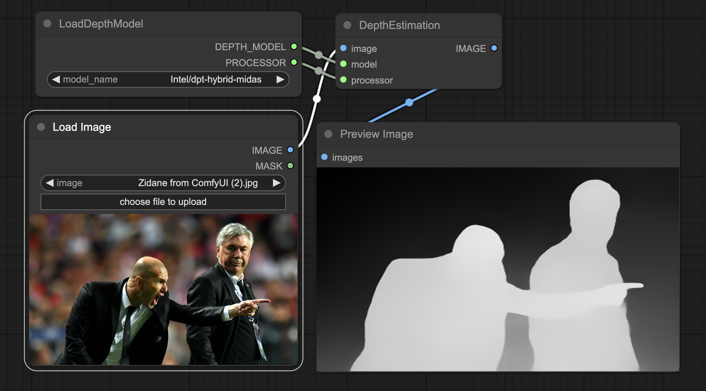

<div align="center">
<h2>
    ComfyUI-Transformers: 
</h2>
<div>
    
</div>
</div>

## 🛠️ Installation

```bash
cd custom/nodes
git clone https://github.com/kadirnar/ComfyUI-Transformers
```


## Depth Estimation


